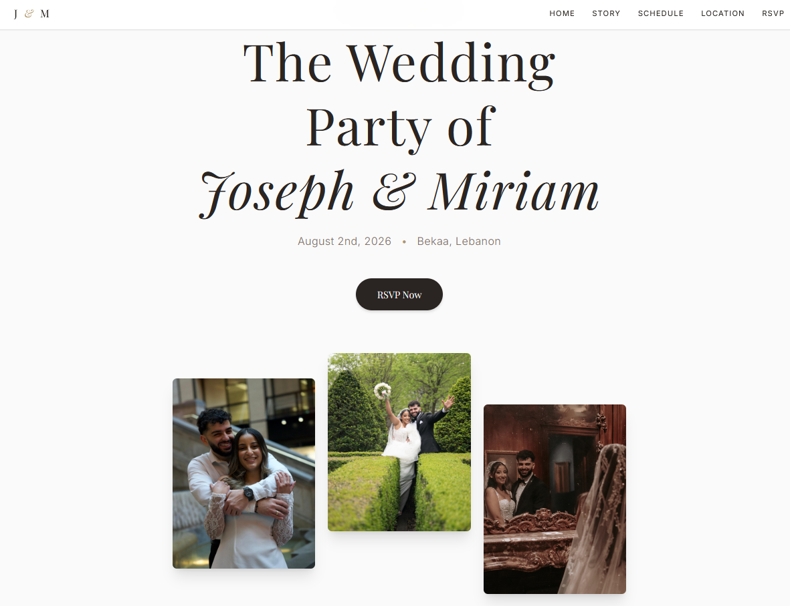

# Joseph & Miriam Wedding RSVP Website

A full-stack wedding website and RSVP management system built for Joseph & Miriam’s Lebanon wedding celebration.

The project includes a responsive React frontend, a Supabase/PostgreSQL backend, guest search, grouped RSVP logic, and a protected admin dashboard.

## Live Site

`https://josephsaidy.github.io/joseph-miriam-wedding-site/`

## Screenshots

### Wedding Website



### RSVP Flow


Guest name search with invitation lookup.


Matched guest group and RSVP form.


RSVP confirmation and submission flow.

### Admin Dashboard


Protected admin dashboard with RSVP stats, guest groups, filters, manual overrides, and CSV export.

### Supabase Backend


Supabase/PostgreSQL backend showing the RSVP database structure and SQL/RPC setup.

## Features

* Elegant responsive wedding landing page
* RSVP guest search with fuzzy matching
* One-row-per-person guest database
* Grouped invitations using `group_name`
* RSVP updates apply to the entire group
* Protected admin dashboard
* Admin search and status filters
* Manual admin RSVP override
* CSV export for RSVP tracking
* Supabase SQL functions for controlled backend access
* GitHub Pages deployment through GitHub Actions

## Tech Stack

**Frontend**

* React
* TypeScript
* Vite
* Tailwind CSS
* Framer Motion

**Backend**

* Supabase
* PostgreSQL
* SQL RPC functions
* Row Level Security

**Tools**

* Replit
* VS Code
* Codex-assisted debugging
* GitHub
* GitHub Actions
* GitHub Pages

## Architecture

The frontend is deployed as a static Vite/React app on GitHub Pages. Supabase handles the backend database and RSVP logic.

```text
React / Vite Frontend
        ↓
Supabase Client
        ↓
PostgreSQL RPC Functions
        ↓
guests table
```

The public frontend does not directly expose full table access. Guest search, RSVP submission, admin data loading, and admin overrides are handled through Supabase RPC functions.

## Database Model

The RSVP system uses one row per invited person. Guests who belong to the same invitation share the same `group_name`.

Example CSV:

```csv
full_name,normalized_name,group_name,is_group_leader,allowed_guests,rsvp_status
Joseph Saidy,joseph saidy,Joseph & Miriam,true,2,pending
Miriam Saidy,miriam saidy,Joseph & Miriam,false,2,pending
Georges Saidy,georges saidy,Georges & Joelle,true,2,pending
Joelle Saidy,joelle saidy,Georges & Joelle,false,2,pending
```

If either person in a group searches their name, the app loads the full group and submits one RSVP for that invitation.

## Supabase RPC Functions

Key backend functions:

* `search_guests_for_rsvp()`
* `get_group_by_guest_id()`
* `submit_rsvp()`
* `get_all_guests_admin()`
* `admin_update_group()`
* `delete_group()`

These functions keep important RSVP and admin logic server-side.

## Security Notes

* No Supabase `service_role` key is used in the frontend
* Secrets are stored as environment variables
* Direct anonymous guest table access is blocked
* RSVP submission is validated server-side
* Attending count cannot exceed the allowed guest count
* Admin actions use controlled RPC functions

## Environment Variables

```env
VITE_SUPABASE_URL=your_supabase_project_url
VITE_SUPABASE_ANON_KEY=your_supabase_anon_key
VITE_ADMIN_PASSWORD=your_admin_password
```

Do not commit real `.env` files or private keys.

## Local Development

Install dependencies:

```bash
pnpm install
```

Run the wedding app:

```bash
pnpm --filter "./artifacts/wedding" run dev
```

Build the wedding app:

```bash
pnpm --filter "./artifacts/wedding" run build
```

## Deployment

The site is deployed to GitHub Pages with GitHub Actions.

The workflow builds only the wedding app inside:

```text
artifacts/wedding
```

and uploads the generated static files to GitHub Pages.

## Skills Demonstrated

* React and TypeScript frontend development
* Responsive UI implementation
* Supabase backend integration
* PostgreSQL schema and RPC design
* Row Level Security awareness
* Admin dashboard development
* CSV import/export handling
* GitHub Actions deployment
* Debugging GitHub Pages path/build issues
* Iterative development with Replit, VS Code, and Codex

## Future Improvements

* Supabase Auth for stronger admin login
* RSVP email notifications
* Rate limiting for guest search
* Caterer-ready export summaries
* Multilingual support
* Custom domain

## License

Personal project built for Joseph & Miriam’s wedding RSVP system.
